# 📘 Guía Frontend - Sistema de Comisiones para Staff

## 📋 Tabla de Contenidos

1. [Introducción](#introducción)
2. [Endpoints Disponibles](#endpoints-disponibles)
3. [Flujos de Trabajo](#flujos-de-trabajo)
4. [Ejemplos de Uso](#ejemplos-de-uso)
5. [Casos de Uso Comunes](#casos-de-uso-comunes)
6. [Manejo de Errores](#manejo-de-errores)
7. [Mejores Prácticas](#mejores-prácticas)

---

## 🎯 Introducción

Este documento describe cómo consumir los endpoints del sistema de comisiones para usuarios tipo STAFF. El sistema permite:

- **Asignar usuarios STAFF a partners** con porcentajes de comisión configurables
- **Calcular comisiones automáticamente** cuando se procesa un pago de suscripción
- **Consultar y gestionar comisiones** acumuladas y pendientes
- **Realizar desembolsos** a los vendedores

### Conceptos Clave

- **Asignación**: Relación entre un usuario STAFF y un partner con un porcentaje de comisión
- **Comisión**: Monto calculado basado en un pago procesado
- **Estado de Comisión**: `pending` (pendiente), `paid` (pagada), `cancelled` (cancelada)
- **Desembolso**: Proceso de marcar comisiones como pagadas

---

## 🔌 Endpoints Disponibles

### Base URL
```
/admin/partner-staff-assignments
/admin/commissions
```

### Autenticación
Todos los endpoints requieren autenticación JWT con rol `ADMIN`.

**Header requerido:**
```
Authorization: Bearer <token>
```

---

## 📍 Endpoints de Asignaciones Staff-Partner

### 1. Crear Asignación

**POST** `/admin/partner-staff-assignments`

Crea una nueva asignación de un usuario STAFF a un partner.

**Request Body:**
```json
{
  "partnerId": 1,
  "staffUserId": 5,
  "commissionPercent": 15.5,
  "startDate": "2024-01-01T00:00:00Z",
  "endDate": "2024-12-31T23:59:59Z", // Opcional
  "notes": "Asignación inicial del vendedor" // Opcional
}
```

**Response (201 Created):**
```json
{
  "id": 1,
  "partnerId": 1,
  "staffUserId": 5,
  "commissionPercent": 15.5,
  "isActive": true,
  "startDate": "2024-01-01T00:00:00Z",
  "endDate": "2024-12-31T23:59:59Z",
  "notes": "Asignación inicial del vendedor",
  "createdAt": "2024-01-01T00:00:00Z"
}
```

**Errores posibles:**
- `400 Bad Request`: Suma de porcentajes excede 100%, fechas inválidas, usuario no es STAFF
- `404 Not Found`: Partner o usuario no encontrado

---

### 2. Listar Asignaciones

**GET** `/admin/partner-staff-assignments`

Obtiene la lista de asignaciones con filtros opcionales.

**Query Parameters:**
- `partnerId` (opcional): Filtrar por ID de partner
- `staffUserId` (opcional): Filtrar por ID de usuario staff
- `activeOnly` (opcional): Solo asignaciones activas (true/false)

**Ejemplo:**
```
GET /admin/partner-staff-assignments?partnerId=1&activeOnly=true
```

**Response (200 OK):**
```json
{
  "assignments": [
    {
      "id": 1,
      "partnerId": 1,
      "partnerName": "Restaurante La Cocina",
      "staffUserId": 5,
      "staffUserName": "Juan Pérez",
      "staffUserEmail": "juan.perez@example.com",
      "commissionPercent": 15.5,
      "isActive": true,
      "startDate": "2024-01-01T00:00:00Z",
      "endDate": "2024-12-31T23:59:59Z",
      "notes": "Asignación inicial",
      "createdAt": "2024-01-01T00:00:00Z",
      "updatedAt": "2024-01-01T00:00:00Z"
    }
  ],
  "total": 1
}
```

---

### 3. Obtener Asignaciones por Partner

**GET** `/admin/partner-staff-assignments/partners/:partnerId`

Obtiene todas las asignaciones de un partner específico.

**Query Parameters:**
- `activeOnly` (opcional): Solo asignaciones activas

**Ejemplo:**
```
GET /admin/partner-staff-assignments/partners/1?activeOnly=true
```

---

### 4. Obtener Asignaciones por Staff

**GET** `/admin/partner-staff-assignments/staff/:staffUserId`

Obtiene todas las asignaciones de un usuario staff específico.

**Query Parameters:**
- `activeOnly` (opcional): Solo asignaciones activas

**Ejemplo:**
```
GET /admin/partner-staff-assignments/staff/5?activeOnly=true
```

---

### 5. Actualizar Asignación

**PATCH** `/admin/partner-staff-assignments/:id`

Actualiza una asignación existente (porcentaje, fechas, estado activo).

**Request Body (todos los campos son opcionales):**
```json
{
  "commissionPercent": 20.0,
  "startDate": "2024-02-01T00:00:00Z",
  "endDate": "2024-12-31T23:59:59Z",
  "isActive": true,
  "notes": "Actualización del porcentaje"
}
```

**Response (200 OK):**
```json
{
  "id": 1,
  "partnerId": 1,
  "staffUserId": 5,
  "commissionPercent": 20.0,
  "isActive": true,
  "startDate": "2024-02-01T00:00:00Z",
  "endDate": "2024-12-31T23:59:59Z",
  "notes": "Actualización del porcentaje",
  "updatedAt": "2024-01-15T00:00:00Z"
}
```

---

### 6. Eliminar Asignación

**DELETE** `/admin/partner-staff-assignments/:id`

Elimina una asignación existente.

**Response (204 No Content)**

---

## 💰 Endpoints de Comisiones

### 1. Obtener Comisiones de un Pago

**GET** `/admin/commissions/payments/:paymentId`

Obtiene todas las comisiones generadas para un pago específico.

**Ejemplo:**
```
GET /admin/commissions/payments/123
```

**Response (200 OK):**
```json
{
  "paymentId": 123,
  "paymentAmount": 1000.00,
  "currency": "USD",
  "paymentDate": "2024-01-15T00:00:00Z",
  "commissions": [
    {
      "id": 1,
      "staffUserId": 5,
      "staffUserName": "Juan Pérez",
      "staffUserEmail": "juan.perez@example.com",
      "commissionPercent": 15.5,
      "commissionAmount": 155.00,
      "status": "pending",
      "paidDate": null,
      "createdAt": "2024-01-15T00:00:00Z"
    }
  ],
  "totalCommissions": 155.00
}
```

---

### 2. Obtener Comisiones con Filtros

**GET** `/admin/commissions`

Obtiene comisiones con filtros opcionales.

**Query Parameters:**
- `staffUserId` (opcional): Filtrar por ID de usuario staff
- `partnerId` (opcional): Filtrar por ID de partner
- `status` (opcional): `pending`, `paid`, `cancelled`
- `startDate` (opcional): Fecha de inicio (ISO 8601)
- `endDate` (opcional): Fecha de fin (ISO 8601)
- `page` (opcional): Número de página (default: 1)
- `limit` (opcional): Resultados por página (default: 50)

**Ejemplo:**
```
GET /admin/commissions?staffUserId=5&status=pending&startDate=2024-01-01T00:00:00Z&page=1&limit=20
```

**Response (200 OK):**
```json
{
  "staffUserId": 5,
  "staffUserName": "Juan Pérez",
  "commissions": [
    {
      "id": 1,
      "staffUserId": 5,
      "staffUserName": "Juan Pérez",
      "staffUserEmail": "juan.perez@example.com",
      "commissionPercent": 15.5,
      "commissionAmount": 155.00,
      "status": "pending",
      "paidDate": null,
      "createdAt": "2024-01-15T00:00:00Z"
    }
  ],
  "summary": {
    "totalPending": 10,
    "totalPaid": 5,
    "totalCancelled": 0,
    "totalAmount": 1550.00,
    "currency": "USD"
  },
  "pagination": {
    "total": 15,
    "page": 1,
    "limit": 20,
    "totalPages": 1
  }
}
```

---

### 3. Obtener Resumen de Comisiones por Staff

**GET** `/admin/commissions/staff/:staffUserId/summary`

Obtiene un resumen completo de comisiones de un usuario staff.

**Query Parameters:**
- `startDate` (opcional): Fecha de inicio (ISO 8601)
- `endDate` (opcional): Fecha de fin (ISO 8601)

**Ejemplo:**
```
GET /admin/commissions/staff/5/summary?startDate=2024-01-01T00:00:00Z&endDate=2024-12-31T23:59:59Z
```

**Response (200 OK):**
```json
{
  "staffUserId": 5,
  "staffUserName": "Juan Pérez",
  "period": {
    "startDate": "2024-01-01T00:00:00Z",
    "endDate": "2024-12-31T23:59:59Z"
  },
  "summary": {
    "totalCommissions": 25,
    "pendingCommissions": 10,
    "paidCommissions": 15,
    "cancelledCommissions": 0,
    "totalAmount": 3875.00,
    "pendingAmount": 1550.00,
    "paidAmount": 2325.00,
    "currency": "USD"
  },
  "byPartner": [
    {
      "partnerId": 1,
      "partnerName": "Restaurante La Cocina",
      "totalCommissions": 15,
      "totalAmount": 2325.00
    },
    {
      "partnerId": 2,
      "partnerName": "Café Central",
      "totalCommissions": 10,
      "totalAmount": 1550.00
    }
  ]
}
```

---

### 4. Obtener Desembolsos Pendientes

**GET** `/admin/commissions/pending-disbursements`

Obtiene la lista de desembolsos pendientes agrupados por usuario staff.

**Query Parameters:**
- `staffUserId` (opcional): Filtrar por ID de usuario staff
- `partnerId` (opcional): Filtrar por ID de partner
- `minAmount` (opcional): Monto mínimo de comisiones pendientes
- `page` (opcional): Número de página
- `limit` (opcional): Resultados por página

**Ejemplo:**
```
GET /admin/commissions/pending-disbursements?minAmount=100&page=1&limit=20
```

**Response (200 OK):**
```json
{
  "disbursements": [
    {
      "staffUserId": 5,
      "staffUserName": "Juan Pérez",
      "staffUserEmail": "juan.perez@example.com",
      "totalPendingAmount": 1550.00,
      "currency": "USD",
      "pendingCommissions": 10,
      "partners": [
        {
          "partnerId": 1,
          "partnerName": "Restaurante La Cocina",
          "amount": 1000.00
        },
        {
          "partnerId": 2,
          "partnerName": "Café Central",
          "amount": 550.00
        }
      ]
    }
  ],
  "summary": {
    "totalStaff": 5,
    "totalPendingAmount": 7750.00,
    "currency": "USD"
  },
  "pagination": {
    "total": 5,
    "page": 1,
    "limit": 20,
    "totalPages": 1
  }
}
```

---

### 5. Marcar Comisiones como Pagadas

**POST** `/admin/commissions/mark-as-paid`

Marca una o más comisiones como pagadas.

**Request Body:**
```json
{
  "commissionIds": [1, 2, 3],
  "paidDate": "2024-01-20T00:00:00Z", // Opcional, default: ahora
  "notes": "Pago realizado mediante transferencia bancaria" // Opcional
}
```

**Response (200 OK):**
```json
{
  "updated": 3,
  "commissions": [
    {
      "id": 1,
      "staffUserId": 5,
      "staffUserName": "Juan Pérez",
      "staffUserEmail": "juan.perez@example.com",
      "commissionPercent": 15.5,
      "commissionAmount": 155.00,
      "status": "paid",
      "paidDate": "2024-01-20T00:00:00Z",
      "createdAt": "2024-01-15T00:00:00Z"
    }
  ]
}
```

---

## 🔄 Flujos de Trabajo

### Flujo 1: Asignar Staff a un Partner


**Pasos del Frontend:**

1. **Cargar lista de partners y usuarios STAFF**
   ```javascript
   // Obtener partners disponibles
   const partners = await fetch('/admin/partners');

   // Obtener usuarios STAFF disponibles
   const staffUsers = await fetch('/admin/users?roles=STAFF,ADMIN');
   ```

2. **Validar porcentajes antes de enviar**
   ```javascript
   // Obtener asignaciones existentes del partner
   const existingAssignments = await fetch(
     `/admin/partner-staff-assignments?partnerId=${partnerId}&activeOnly=true`
   );

   // Calcular suma de porcentajes
   const totalPercent = existingAssignments.reduce(
     (sum, a) => sum + a.commissionPercent,
     0
   );

   // Validar que no exceda 100%
   if (totalPercent + newPercent > 100) {
     showError('La suma de porcentajes no puede exceder 100%');
     return;
   }
   ```

3. **Crear asignación**
   ```javascript
   const response = await fetch('/admin/partner-staff-assignments', {
     method: 'POST',
     headers: {
       'Content-Type': 'application/json',
       'Authorization': `Bearer ${token}`
     },
     body: JSON.stringify({
       partnerId: selectedPartnerId,
       staffUserId: selectedStaffUserId,
       commissionPercent: commissionPercent,
       startDate: startDate.toISOString(),
       endDate: endDate?.toISOString() || null,
       notes: notes || null
     })
   });
   ```

---

### Flujo 2: Consultar Comisiones de un Pago

```mermaid
graph TD
    A[Admin visualiza lista de pagos] --> B[Selecciona un pago]
    B --> C[Envía GET /commissions/payments/:paymentId]
    C --> D[Recibe comisiones del pago]
    D --> E[Muestra desglose de comisiones]
    E --> F[Muestra total de comisiones]
```



**Ejemplo de implementación:**

```javascript
async function getPaymentCommissions(paymentId) {
  try {
    const response = await fetch(
      `/admin/commissions/payments/${paymentId}`,
      {
        headers: {
          'Authorization': `Bearer ${token}`
        }
      }
    );

    const data = await response.json();

    // Mostrar información del pago
    console.log(`Pago: $${data.paymentAmount} ${data.currency}`);
    console.log(`Total comisiones: $${data.totalCommissions}`);

    // Mostrar desglose por staff
    data.commissions.forEach(commission => {
      console.log(`${commission.staffUserName}: $${commission.commissionAmount} (${commission.commissionPercent}%)`);
    });

    return data;
  } catch (error) {
    console.error('Error al obtener comisiones:', error);
  }
}
```

---

### Flujo 3: Gestionar Desembolsos Pendientes

```mermaid
graph TD
    A[Admin accede a Desembolsos] --> B[Envía GET /commissions/pending-disbursements]
    B --> C[Recibe lista agrupada por staff]
    C --> D[Muestra resumen total]
    D --> E[Admin selecciona staff]
    E --> F[Muestra detalle por partner]
    F --> G[Admin selecciona comisiones a pagar]
    G --> H[Envía POST /commissions/mark-as-paid]
    H --> I[Comisiones marcadas como pagadas]
    I --> J[Actualiza vista]
```



**Ejemplo de implementación:**

```javascript
// 1. Obtener desembolsos pendientes
async function getPendingDisbursements(filters = {}) {
  const queryParams = new URLSearchParams(filters);
  const response = await fetch(
    `/admin/commissions/pending-disbursements?${queryParams}`,
    {
      headers: {
        'Authorization': `Bearer ${token}`
      }
    }
  );

  return await response.json();
}

// 2. Marcar comisiones como pagadas
async function markCommissionsAsPaid(commissionIds, paidDate = null, notes = null) {
  const response = await fetch('/admin/commissions/mark-as-paid', {
    method: 'POST',
    headers: {
      'Content-Type': 'application/json',
      'Authorization': `Bearer ${token}`
    },
    body: JSON.stringify({
      commissionIds: commissionIds,
      paidDate: paidDate?.toISOString() || null,
      notes: notes || null
    })
  });

  return await response.json();
}

// 3. Uso combinado
async function processDisbursement(staffUserId) {
  // Obtener comisiones pendientes del staff
  const commissions = await fetch(
    `/admin/commissions?staffUserId=${staffUserId}&status=pending`
  );
  const data = await commissions.json();

  // Seleccionar todas las comisiones pendientes
  const commissionIds = data.commissions.map(c => c.id);

  // Marcar como pagadas
  const result = await markCommissionsAsPaid(
    commissionIds,
    new Date(),
    'Pago mensual de comisiones'
  );

  console.log(`${result.updated} comisiones marcadas como pagadas`);
}
```

---

### Flujo 4: Dashboard de Comisiones por Staff

```mermaid
graph TD
    A[Admin selecciona Staff] --> B[Envía GET /commissions/staff/:id/summary]
    B --> C[Recibe resumen completo]
    C --> D[Muestra métricas generales]
    D --> E[Muestra desglose por partner]
    E --> F[Opcional: Filtrar por período]
```



**Ejemplo de implementación:**

```javascript
async function getStaffCommissionSummary(staffUserId, startDate, endDate) {
  const params = new URLSearchParams();
  if (startDate) params.append('startDate', startDate.toISOString());
  if (endDate) params.append('endDate', endDate.toISOString());

  const response = await fetch(
    `/admin/commissions/staff/${staffUserId}/summary?${params}`,
    {
      headers: {
        'Authorization': `Bearer ${token}`
      }
    }
  );

  const summary = await response.json();

  // Mostrar métricas
  console.log(`Total comisiones: ${summary.summary.totalCommissions}`);
  console.log(`Pendientes: ${summary.summary.pendingCommissions} ($${summary.summary.pendingAmount})`);
  console.log(`Pagadas: ${summary.summary.paidCommissions} ($${summary.summary.paidAmount})`);

  // Mostrar por partner
  summary.byPartner.forEach(partner => {
    console.log(`${partner.partnerName}: ${partner.totalCommissions} comisiones - $${partner.totalAmount}`);
  });

  return summary;
}
```

---

## 💡 Casos de Uso Comunes

### Caso 1: Asignar Múltiples Staff a un Partner

**Escenario:** Un partner tiene múltiples vendedores asignados con diferentes porcentajes.

```javascript
async function assignMultipleStaffToPartner(partnerId, assignments) {
  const results = [];

  for (const assignment of assignments) {
    try {
      const response = await fetch('/admin/partner-staff-assignments', {
        method: 'POST',
        headers: {
          'Content-Type': 'application/json',
          'Authorization': `Bearer ${token}`
        },
        body: JSON.stringify({
          partnerId: partnerId,
          staffUserId: assignment.staffUserId,
          commissionPercent: assignment.commissionPercent,
          startDate: assignment.startDate,
          endDate: assignment.endDate || null,
          notes: assignment.notes || null
        })
      });

      if (response.ok) {
        results.push(await response.json());
      } else {
        const error = await response.json();
        console.error(`Error asignando staff ${assignment.staffUserId}:`, error);
      }
    } catch (error) {
      console.error(`Error asignando staff ${assignment.staffUserId}:`, error);
    }
  }

  return results;
}

// Uso
await assignMultipleStaffToPartner(1, [
  {
    staffUserId: 5,
    commissionPercent: 10,
    startDate: new Date('2024-01-01'),
    notes: 'Vendedor principal'
  },
  {
    staffUserId: 6,
    commissionPercent: 5,
    startDate: new Date('2024-01-01'),
    notes: 'Vendedor secundario'
  }
]);
```

---

### Caso 2: Reporte Mensual de Comisiones

**Escenario:** Generar un reporte mensual de todas las comisiones.

```javascript
async function generateMonthlyCommissionReport(year, month) {
  const startDate = new Date(year, month - 1, 1);
  const endDate = new Date(year, month, 0, 23, 59, 59);

  // Obtener todos los usuarios STAFF
  const staffUsers = await fetch('/admin/users?roles=STAFF,ADMIN');
  const staff = await staffUsers.json();

  const report = [];

  for (const staffUser of staff) {
    const summary = await fetch(
      `/admin/commissions/staff/${staffUser.id}/summary?` +
      `startDate=${startDate.toISOString()}&endDate=${endDate.toISOString()}`
    );

    const data = await summary.json();

    report.push({
      staffId: staffUser.id,
      staffName: staffUser.name,
      staffEmail: staffUser.email,
      totalCommissions: data.summary.totalCommissions,
      pendingAmount: data.summary.pendingAmount,
      paidAmount: data.summary.paidAmount,
      totalAmount: data.summary.totalAmount,
      byPartner: data.byPartner
    });
  }

  return report;
}

// Uso
const report = await generateMonthlyCommissionReport(2024, 1);
console.table(report);
```

---

### Caso 3: Validar Antes de Crear Asignación

**Escenario:** Validar que la suma de porcentajes no exceda 100% antes de crear una asignación.

```javascript
async function validateAndCreateAssignment(assignmentData) {
  // 1. Obtener asignaciones existentes del partner
  const existingResponse = await fetch(
    `/admin/partner-staff-assignments?partnerId=${assignmentData.partnerId}&activeOnly=true`
  );
  const existing = await existingResponse.json();

  // 2. Calcular suma de porcentajes (excluyendo la que se está actualizando si aplica)
  const totalPercent = existing.assignments
    .filter(a => a.id !== assignmentData.excludeId)
    .reduce((sum, a) => sum + a.commissionPercent, 0);

  // 3. Validar
  if (totalPercent + assignmentData.commissionPercent > 100) {
    throw new Error(
      `La suma de porcentajes excedería 100%. ` +
      `Actual: ${totalPercent}%, Nuevo: ${assignmentData.commissionPercent}%, ` +
      `Total: ${totalPercent + assignmentData.commissionPercent}%`
    );
  }

  // 4. Crear asignación
  const response = await fetch('/admin/partner-staff-assignments', {
    method: 'POST',
    headers: {
      'Content-Type': 'application/json',
      'Authorization': `Bearer ${token}`
    },
    body: JSON.stringify(assignmentData)
  });

  if (!response.ok) {
    const error = await response.json();
    throw new Error(error.message || 'Error al crear asignación');
  }

  return await response.json();
}
```

---

## ⚠️ Manejo de Errores

### Errores Comunes y Cómo Manejarlos

#### 1. Error 400: Suma de porcentajes excede 100%

```javascript
try {
  await createAssignment(assignmentData);
} catch (error) {
  if (error.status === 400) {
    const errorData = await error.json();
    if (errorData.message.includes('porcentajes')) {
      // Mostrar mensaje amigable al usuario
      showError('La suma de porcentajes de comisión no puede exceder 100%');
      // Sugerir ajustar porcentajes
      suggestPercentageAdjustment();
    }
  }
}
```

#### 2. Error 404: Recurso no encontrado

```javascript
async function getCommissionSummary(staffUserId) {
  try {
    const response = await fetch(`/admin/commissions/staff/${staffUserId}/summary`);

    if (response.status === 404) {
      showMessage('Usuario staff no encontrado');
      return null;
    }

    return await response.json();
  } catch (error) {
    console.error('Error:', error);
    showError('Error al obtener resumen de comisiones');
  }
}
```

#### 3. Error 409: Conflicto (asignación duplicada)

```javascript
try {
  await createAssignment(assignmentData);
} catch (error) {
  if (error.status === 409) {
    showError('Ya existe una asignación activa con estas características');
    // Ofrecer opción de actualizar en lugar de crear
    offerUpdateOption();
  }
}
```

---

## ✅ Mejores Prácticas

### 1. Validación en el Frontend

Siempre valida los datos antes de enviarlos al backend:

```javascript
function validateAssignment(assignment) {
  const errors = [];

  // Validar porcentaje
  if (assignment.commissionPercent < 0 || assignment.commissionPercent > 100) {
    errors.push('El porcentaje debe estar entre 0 y 100');
  }

  // Validar fechas
  if (assignment.endDate && assignment.startDate >= assignment.endDate) {
    errors.push('La fecha de inicio debe ser anterior a la fecha de fin');
  }

  // Validar que se seleccionó partner y staff
  if (!assignment.partnerId) {
    errors.push('Debe seleccionar un partner');
  }

  if (!assignment.staffUserId) {
    errors.push('Debe seleccionar un usuario staff');
  }

  return errors;
}
```

### 2. Caché de Datos

Cachea datos que no cambian frecuentemente:

```javascript
// Cachear lista de usuarios STAFF
let staffUsersCache = null;
let staffUsersCacheTime = null;
const CACHE_DURATION = 5 * 60 * 1000; // 5 minutos

async function getStaffUsers(forceRefresh = false) {
  const now = Date.now();

  if (!forceRefresh &&
      staffUsersCache &&
      (now - staffUsersCacheTime) < CACHE_DURATION) {
    return staffUsersCache;
  }

  const response = await fetch('/admin/users?roles=STAFF,ADMIN');
  staffUsersCache = await response.json();
  staffUsersCacheTime = now;

  return staffUsersCache;
}
```

### 3. Paginación

Siempre implementa paginación para listas grandes:

```javascript
async function getCommissionsPaginated(filters, page = 1, limit = 20) {
  const params = new URLSearchParams({
    ...filters,
    page: page.toString(),
    limit: limit.toString()
  });

  const response = await fetch(`/admin/commissions?${params}`);
  const data = await response.json();

  return {
    commissions: data.commissions,
    pagination: data.pagination,
    summary: data.summary
  };
}
```

### 4. Loading States

Muestra estados de carga mientras se procesan las peticiones:

```javascript
const [loading, setLoading] = useState(false);
const [commissions, setCommissions] = useState([]);

async function loadCommissions() {
  setLoading(true);
  try {
    const data = await getCommissionsPaginated({});
    setCommissions(data.commissions);
  } finally {
    setLoading(false);
  }
}
```

### 5. Formato de Moneda

Formatea correctamente los montos:

```javascript
function formatCurrency(amount, currency = 'USD') {
  return new Intl.NumberFormat('es-GT', {
    style: 'currency',
    currency: currency
  }).format(amount);
}

// Uso
formatCurrency(1550.50, 'USD'); // "$1,550.50"
formatCurrency(1550.50, 'GTQ'); // "GTQ 1,550.50"
```

### 6. Formato de Fechas

Formatea fechas de manera consistente:

```javascript
function formatDate(dateString) {
  const date = new Date(dateString);
  return new Intl.DateTimeFormat('es-GT', {
    year: 'numeric',
    month: 'long',
    day: 'numeric'
  }).format(date);
}

function formatDateTime(dateString) {
  const date = new Date(dateString);
  return new Intl.DateTimeFormat('es-GT', {
    year: 'numeric',
    month: 'long',
    day: 'numeric',
    hour: '2-digit',
    minute: '2-digit'
  }).format(date);
}
```

---

## 📊 Ejemplos de Componentes React/Vue

### Componente de Lista de Asignaciones (React)

```jsx
import React, { useState, useEffect } from 'react';

function AssignmentsList({ partnerId }) {
  const [assignments, setAssignments] = useState([]);
  const [loading, setLoading] = useState(true);

  useEffect(() => {
    loadAssignments();
  }, [partnerId]);

  async function loadAssignments() {
    setLoading(true);
    try {
      const response = await fetch(
        `/admin/partner-staff-assignments?partnerId=${partnerId}&activeOnly=true`
      );
      const data = await response.json();
      setAssignments(data.assignments);
    } catch (error) {
      console.error('Error:', error);
    } finally {
      setLoading(false);
    }
  }

  if (loading) return <div>Cargando...</div>;

  return (
    <div>
      <h2>Asignaciones Activas</h2>
      <table>
        <thead>
          <tr>
            <th>Staff</th>
            <th>Porcentaje</th>
            <th>Fecha Inicio</th>
            <th>Fecha Fin</th>
            <th>Acciones</th>
          </tr>
        </thead>
        <tbody>
          {assignments.map(assignment => (
            <tr key={assignment.id}>
              <td>{assignment.staffUserName}</td>
              <td>{assignment.commissionPercent}%</td>
              <td>{formatDate(assignment.startDate)}</td>
              <td>{assignment.endDate ? formatDate(assignment.endDate) : 'Sin fin'}</td>
              <td>
                <button onClick={() => editAssignment(assignment.id)}>Editar</button>
                <button onClick={() => deleteAssignment(assignment.id)}>Eliminar</button>
              </td>
            </tr>
          ))}
        </tbody>
      </table>
    </div>
  );
}
```

### Componente de Dashboard de Comisiones (React)

```jsx
import React, { useState, useEffect } from 'react';

function CommissionDashboard({ staffUserId }) {
  const [summary, setSummary] = useState(null);
  const [loading, setLoading] = useState(true);
  const [dateRange, setDateRange] = useState({
    startDate: new Date(new Date().getFullYear(), 0, 1),
    endDate: new Date()
  });

  useEffect(() => {
    loadSummary();
  }, [staffUserId, dateRange]);

  async function loadSummary() {
    setLoading(true);
    try {
      const params = new URLSearchParams({
        startDate: dateRange.startDate.toISOString(),
        endDate: dateRange.endDate.toISOString()
      });

      const response = await fetch(
        `/admin/commissions/staff/${staffUserId}/summary?${params}`
      );
      const data = await response.json();
      setSummary(data);
    } catch (error) {
      console.error('Error:', error);
    } finally {
      setLoading(false);
    }
  }

  if (loading) return <div>Cargando...</div>;
  if (!summary) return <div>No hay datos</div>;

  return (
    <div>
      <h2>Resumen de Comisiones - {summary.staffUserName}</h2>

      <div className="metrics">
        <div className="metric">
          <label>Total Comisiones</label>
          <value>{summary.summary.totalCommissions}</value>
        </div>
        <div className="metric">
          <label>Pendientes</label>
          <value>{formatCurrency(summary.summary.pendingAmount)}</value>
        </div>
        <div className="metric">
          <label>Pagadas</label>
          <value>{formatCurrency(summary.summary.paidAmount)}</value>
        </div>
        <div className="metric">
          <label>Total</label>
          <value>{formatCurrency(summary.summary.totalAmount)}</value>
        </div>
      </div>

      <h3>Por Partner</h3>
      <table>
        <thead>
          <tr>
            <th>Partner</th>
            <th>Comisiones</th>
            <th>Total</th>
          </tr>
        </thead>
        <tbody>
          {summary.byPartner.map(partner => (
            <tr key={partner.partnerId}>
              <td>{partner.partnerName}</td>
              <td>{partner.totalCommissions}</td>
              <td>{formatCurrency(partner.totalAmount)}</td>
            </tr>
          ))}
        </tbody>
      </table>
    </div>
  );
}
```

---

## 🔗 Integración con Otros Módulos

### Relación con Pagos

Cuando se visualiza un pago, puedes mostrar las comisiones asociadas:

```javascript
async function getPaymentWithCommissions(paymentId) {
  const [payment, commissions] = await Promise.all([
    fetch(`/admin/payments/${paymentId}`),
    fetch(`/admin/commissions/payments/${paymentId}`)
  ]);

  return {
    payment: await payment.json(),
    commissions: await commissions.json()
  };
}
```

### Relación con Partners

Al visualizar un partner, muestra las asignaciones activas:

```javascript
async function getPartnerWithAssignments(partnerId) {
  const [partner, assignments] = await Promise.all([
    fetch(`/admin/partners/${partnerId}`),
    fetch(`/admin/partner-staff-assignments/partners/${partnerId}?activeOnly=true`)
  ]);

  return {
    partner: await partner.json(),
    assignments: await assignments.json()
  };
}
```

---

## 📝 Notas Adicionales

1. **Cálculo Automático**: Las comisiones se calculan automáticamente cuando un pago se marca como `paid`. No es necesario llamar ningún endpoint para calcularlas.

2. **Estados de Comisión**:
   - `pending`: Comisión calculada pero no pagada
   - `paid`: Comisión pagada al staff
   - `cancelled`: Comisión cancelada (no se pagará)

3. **Validaciones Importantes**:
   - La suma de porcentajes de comisión para un partner no puede exceder 100%
   - Solo usuarios con rol STAFF o ADMIN pueden ser asignados
   - Las asignaciones pueden tener fechas de inicio y fin

4. **Performance**:
   - Usa paginación para listas grandes
   - Cachea datos que no cambian frecuentemente
   - Considera usar debounce para búsquedas

---

**Última actualización:** 2024-01-XX
**Versión API:** 1.0.0

